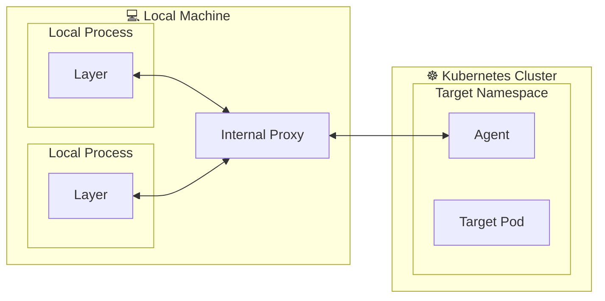

## A 1000-foot view

```mermaid
graph LR
    subgraph Local["💻 Local Machine"]
        direction TB
        subgraph Process1["Local Process"]
            Layer1[Layer]
        end
        subgraph Process2["Local Process"]
            Layer2[Layer]
        end
        IntProxy[Internal Proxy]
    end

    subgraph Cluster["☸️ Kubernetes Cluster"]
        direction TB
        subgraph TargetNS["Target Namespace"]
            Agent[Agent]
            Target[Target Pod]
        end
    end

    Layer1<-->IntProxy
    Layer2<-->IntProxy
    IntProxy<-->Agent
```

