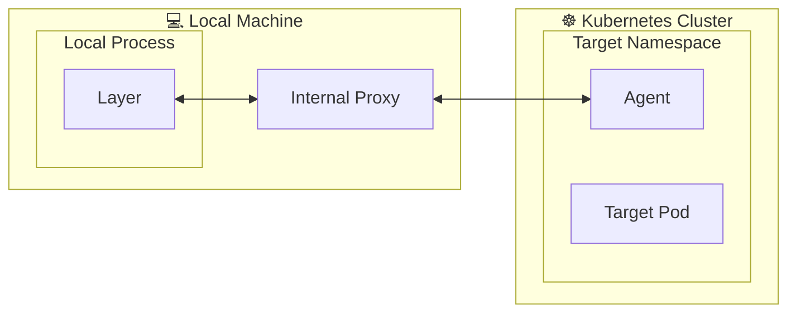

## A 1000-foot view

Depending on how mirrord deploys and connects to its agent running in the cloud, the overall 
architecture and the components involved may vary. 

### Direct Kubernetes Port Forwarding

### External Proxy

### `mirrord` Operator
